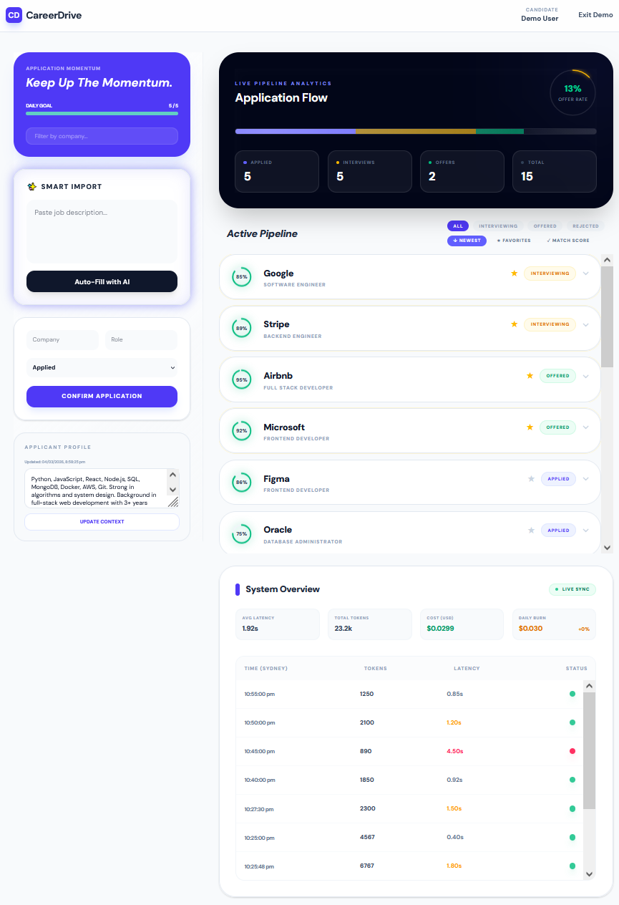
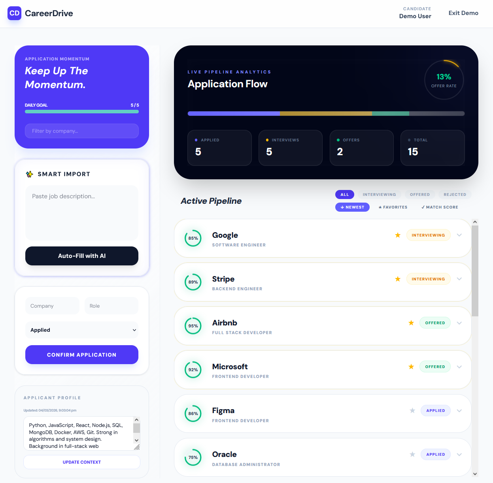
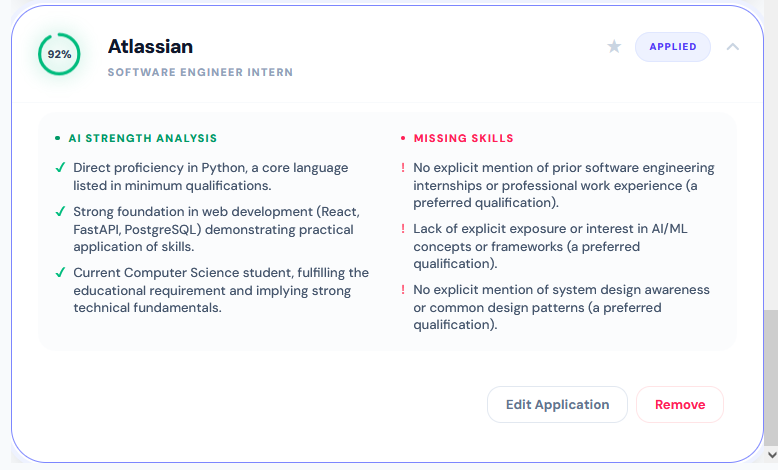
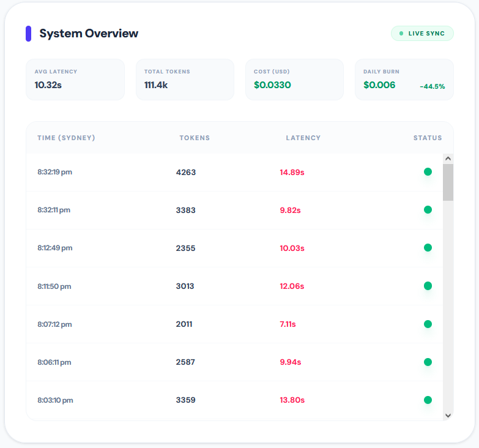

# CareerDrive

AI-powered job application tracker: paste a job description and get instant role-fit analysis against your profile.

🔗 [Live Demo](https://careerdrive.vercel.app) (currently down due to free tier) | 📡 [API Docs](https://careerdrive.onrender.com/docs)



---

## What it does

CareerDrive is a full-stack job application tracker built for active job seekers, tailored for the tech industry. Paste a job description and Gemini AI parses it instantly, extracting the company and role whilst evaluating your fit against your saved skills and experience profile. Each application receives a match percentage, a breakdown of strengths and gaps and is stored with full CRUD support. A funnel dashboard tracks your application pipeline and every AI inference is logged with token count, latency, and estimated cost.

---

## Features

- **AI job parser** - paste a job description, auto-fills company, role, and notes via Gemini API
- **Role-fit scoring** - match percentage with pros and cons evaluated against your saved profile
- **Application tracking** - create, update, delete and filter applications with status tracking (Applied, Interviewing, Offered, Rejected)
- **Application funnel** - visual progress bar showing pipeline conversion across statuses
- **LLM ops dashboard** - every inference logged with token usage, API latency, and estimated cost in USD
- **Google OAuth** - one-click sign in via Supabase Auth
- **Per-user data isolation** - row-level security enforced at both the API and database layer
- **Demo mode** - frontend demo with pre-filled data, no login required

---

## Screenshots

### Dashboard Overview


### Match Analysis


### LLM Ops


---

## Architecture

```
User (Browser)
      │
      ▼
React Frontend (Vercel)
  ├── Google OAuth → Supabase Auth
  ├── POST /parse-job        → AI parsing + fit scoring
  ├── GET/POST/PATCH/DELETE /applications → CRUD
  ├── GET /profile           → user skills + experience
  ├── GET /parse-logs        → LLM ops dashboard
  └── GET /stats/global      → aggregate platform stats
      │
      ▼
FastAPI Backend (Render)
  ├── Verifies JWT token via Supabase Auth
  ├── Fetches user profile from PostgreSQL
  ├── Calls Google Gemini API with job description + profile
  ├── Logs token usage, latency, cost to parse_logs table
  └── Returns structured JSON (company, role, match_score, pros, cons)
      │
      ├──────────────────────┐
      ▼                      ▼
PostgreSQL (Supabase)   Google Gemini API
  ├── applications           └── gemini-2.5-flash
  ├── profiles                   (temperature: 0)
  └── parse_logs
```

---

## Key Engineering Decisions

**RLS enforced at both the API and database layer**
JWT tokens are verified in FastAPI before any query runs. Unauthenticated requests are rejected with a 401 before touching the database. Row-level security policies in Supabase enforced so that authenticated users can only read and write their own rows. This double-layer means even a bug in application logic can't accidentally leak another user's data.

**LLM cost tracking per request**
Every call to the Gemini API logs prompt tokens, output tokens, latency, and estimated cost in USD to a `parse_logs` table; in a production system, unmonitored LLM usage can be a significant cost risk. Logging per-request spend makes usage patterns visible and provides the data needed to optimise prompts or swap models if costs grow.

**Profile-aware prompting over generic parsing**
Rather than just extracting job details, the parser includes the user's saved skills and experience in the prompt for a personalised fit evaluation. The AI returns a match percentage and specific gaps, making the output actionable rather than just a reformatted job description.

**Temperature set to 0 for consistency**
Match scores and analysis are more useful when they're deterministic. Setting `temperature: 0` on the Gemini API call reduces variance between runs on the same input, making scores more reliable for comparing applications against each other.

**Supabase Auth over custom JWT implementation**
Rolling a custom auth system (hashing passwords, issuing JWTs, handling refresh tokens) is error-prone and time-consuming. Supabase Auth handles and ships Google OAuth out of the box, delivering a more polished login experience in a fraction of the time, backed by Google's security infrastructure.

**Service role key in backend, anon key in frontend**
The Supabase service role key bypasses RLS entirely and is only used server-side in FastAPI, where token verification already happens. The anon key is used in the frontend where it has no special privileges. This separation means the privileged key is never exposed to the browser.

---

## Tech Stack

| Layer | Technology |
|-------|-----------|
| Backend | Python, FastAPI |
| Database | PostgreSQL (Supabase) |
| Auth | Supabase Auth (Google OAuth) |
| AI | Google Gemini API (gemini-2.5-flash) |
| Frontend | React, Vite, Tailwind CSS, Recharts |
| Deployment | Render (backend), Vercel (frontend) |

---

## Running Locally

### Prerequisites
- Python 3.12+
- Node.js 20+
- A Supabase project
- A Google Gemini API key
- Google OAuth credentials (via Google Cloud Console)

### Backend

```bash
cd backend
pip install -r requirements.txt
```

Create a `.env` file in the backend directory:

```
SUPABASE_URL=https://yourproject.supabase.co
SUPABASE_KEY=your-service-role-key
GEMINI_API_KEY=your-gemini-api-key
```

```bash
uvicorn main:app --reload
```

### Frontend

```bash
cd frontend
npm install
```

Create a `.env` file in the frontend directory:

```
VITE_SUPABASE_URL=https://yourproject.supabase.co
VITE_SUPABASE_ANON_KEY=your-anon-key
```

```bash
npm run dev
```

Open [http://localhost:5173](http://localhost:5173).

---

## Database Schema

```sql
-- User profiles
create table profiles (
  id uuid references auth.users(id) primary key,
  skills text,
  experience text,
  created_at timestamp default now()
);

-- Job applications
create table applications (
  id uuid default gen_random_uuid() primary key,
  user_id uuid references auth.users(id),
  company text not null,
  role text not null,
  status text default 'applied',
  date_applied date,
  job_url text,
  notes text,
  match_score int,
  pros text[],
  cons text[],
  created_at timestamp default now()
);

-- LLM inference logs
create table parse_logs (
  id uuid default gen_random_uuid() primary key,
  user_id uuid references auth.users(id),
  prompt_tokens int,
  output_tokens int,
  total_tokens int,
  latency_seconds float,
  estimated_cost_usd float,
  success boolean,
  created_at timestamp default now()
);
```

---

## Future Improvements

- **Status history tracking** - log every status change with a timestamp to enable a Sankey diagram of application journeys
- **URL parsing** - fetch and parse job descriptions directly from a URL, not just pasted text
- **CI/CD pipeline** - GitHub Actions for automated testing and deployment
- **Mobile responsive UI** - optimise layout for smaller screens
- **Email notifications** - remind users to follow up on applications after X days
